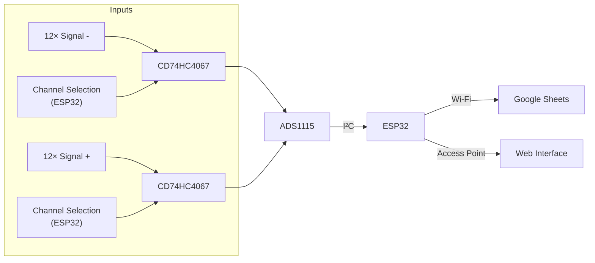

<div align="right">
  🇺🇸 <strong>English</strong> | 🇧🇷 <a href="README.pt-br.md">Português</a>
</div>

<br>

# BioMon - Data Acquisition System for Low-Voltage Bioelectricity Measurement

> **Summary:** A dedicated, scalable, and low-cost system for continuous bioelectricity acquisition at the millivolt scale, focused on microbial fuel cells (MFCs).
>
> **Context:** Project developed as part of the **Ubiquitous and Embedded Systems Project (DEC0021)** course, in the **Computer Engineering** program at the **Federal University of Santa Catarina – Araranguá Campus**, under the supervision of **Prof. Dr. Jim Lau**.
>
> Author: **Lucas Porto Ribeiro**
> 
> Semester: **2026/1**

---

## 📖 Introduction

Microbial fuel cells (MFCs) are bioelectrochemical technologies that use microorganisms as biocatalysts to directly convert the chemical energy of organic substrates into electrical energy. They have a wide range of applications, including renewable energy generation, wastewater treatment, and biosensing.

The metabolic activity of these microorganisms causes the generated voltage to fluctuate over time, making **continuous monitoring** essential. The main challenge is to simultaneously and accurately record multiple voltage levels in the millivolt range, since high-precision commercial data loggers are expensive and manual multimeters do not provide scalability.

This project proposes an architecture based on the ESP32 microcontroller to measure **12 simultaneous channels**, overcoming cost and hardware limitations while automating data transmission to the cloud.

---

## 🛠️ Required Hardware

To build the solution, the components were divided into two categories. The **Main Hardware** subsection lists the essential components required for data processing and the logical operation of the system. The **Integration Hardware** subsection covers the complementary components required for power supply, assembly, and transformation of the circuit into a functional physical device.

### Main Hardware

* **ESP32 Microcontroller:** The core of the project. It provides processing capabilities, Wi-Fi connectivity, and hosts the local web page for real-time monitoring.
* **ADS1115 Analog-to-Digital Converter (ADC):** Provides 16-bit resolution. It is essential because the ESP32's internal ADC has nonlinear behavior and lower resolution. Its resolution varies according to the configured gain, ranging from 0.0078125 mV per bit (16× gain) to 0.1875 mV per bit (2/3× gain), allowing the resolution to be adapted to the measured voltage range.
* **2× CD74HC4067 Multiplexers:** 16-channel analog multiplexers that act as "selector switches." Since the ADS1115 has a limited number of channels, the multiplexers expand the system to the 12 required positive and negative pairs.

### Integration Hardware

* **Rechargeable 18650 Lithium Battery:** Provides the autonomous power required by the system.
* **18650 Battery Holder:** Used to connect the battery to the circuit.
* **TP4056 Module:** Responsible for charging the lithium battery.
* **MT3608 Step-Up Module:** Voltage regulator used to increase the battery output voltage to 5 V while maintaining a stable output.
* **Power Switch:** Allows the equipment to be turned on and off.
* **LED:** Provides a visual indication of the system status (on/off).
* **220 Ω Resistor:** Used to limit the current supplied to the LED.
* **8× KRE Connectors (3 terminals):** Used as secure connection ports for the cables coming from the 24 biological beakers.
* **JST-XH Connectors (Male and Female):** Facilitate power connections to the main board.
* **Female Pin Headers:** Used to connect the components to the board. Quantities used: two 16-pin rows, two 15-pin rows, one 10-pin row, and two 8-pin rows.
* **Copper Board:** Base for component placement and electrical trace routing.

---

## 🔌 Connection Scheme

The acquisition system is based on differential readings in pairs. The logical connection works as follows:

1. The signal outputs from the beakers are connected directly to the input pins of the two **CD74HC4067** multiplexers — one manages the positive polarity and the other manages the negative polarity.
2. The **ESP32** controls channel selection through the `S0`, `S1`, `S2`, and `S3` pins, mapped to GPIOs 32, 33, 25, and 26, synchronously across both multiplexers.
3. The common outputs of the multiplexers are connected to GND and to the `A0` pin of the **ADS1115**.
4. The **ADS1115** performs the high-resolution conversion and sends the digital data back to the **ESP32** using the **I2C** protocol (SDA and SCL).

### Circuit Design

The schematic below shows the circuit diagram designed and assembled using EasyEDA, detailing the electrical connections between the components:

<p align="center">
  
</p>

Based on the schematic, the printed circuit board (PCB) design was developed. The following images show the electrical trace routing alongside the 3D rendering of the developed PCB, illustrating the final physical arrangement of the connectors and modules:

<p align="center">
  
  
</p>

---

## ⚙️ Software

The software was developed in C++. Its workflow, from signal acquisition to data transmission, is illustrated in the block diagram below.



### Required Libraries and Tools

* ESP32 board package installed in the Arduino IDE.
* `WiFi.h` library (built-in).
* `Preferences.h` library (built-in).
* `Adafruit_ADS1X15` library (ADC communication).
* `ESP_Google_Sheet_Client` library (secure Google Cloud access and authentication).
* `mongoose_glue.h` library (embedded web server — Mongoose Wizard).

### Source Code Structure

The main project code is organized as follows:

```text
src/
├── biomon_wizard/
│   └── biomon_wizard.ino
│
└── mongoose/
    ├── mongoose.c
    ├── mongoose.h
    ├── mongoose_config.h
    ├── mongoose_fs.c
    ├── mongoose_glue.c
    ├── mongoose_glue.h
    ├── mongoose_impl.c
    └── mongoose_wizard.json
```

The main firmware is located at `src/biomon_wizard/biomon_wizard.ino`, while the Mongoose-related files are organized separately under `src/mongoose/`.

---

## 🚀 Installation

### 1. Clone the Repository

Clone this repository to your computer.

### 2. Open the Project

Open the following file in the Arduino IDE:

```text
src/biomon_wizard/biomon_wizard.ino
```

### 3. Configure Google Sheets

Fill in the following Google Sheets variables:

```text
PROJECT_ID
CLIENT_EMAIL
PRIVATE_KEY
```

using the credentials from your Google Service Account.

### 4. Compile and Upload

Select the appropriate ESP32 board in the Arduino IDE, compile the project, and upload the firmware to the microcontroller.

---

## 📋 Usage Instructions

The image below provides step-by-step instructions for the correct use and initial configuration of the system:

<p align="center">
  
</p>

---

## 🚀 Final Project

After integrating the hardware and software, the equipment was assembled into its final structure. The images below show the final physical system developed and ready for use:

<p align="center">
  
  
  
</p>

The resulting firmware (`biomon_wizard.ino`) fulfills the specified functional requirements:

* **Access Point & Station Mode:** The ESP32 creates its own Wi-Fi network while simultaneously attempting to connect to the laboratory's local internet network to transmit data.
* **Embedded Web Server:** Provides real-time access through a smartphone or computer to a virtual digital multimeter, where connectivity parameters and the sampling interval can be configured.
* **Cloud:** Processes samples in batches and periodically sends the data to a **Google Sheets** spreadsheet, avoiding API call quota limitations.
* **Memory:** Uses the `Preferences` library to persistently store the network and passwords configured through the interface.

### Interfaces and Data Visualization

For local monitoring, the embedded web server provides a user-friendly interface. The screenshots below show the Web Interface, which acts as a real-time digital multimeter and configuration panel:

<p align="center">
  
  
</p>

The collected data is automatically sent to the cloud. The image below shows the Google Sheets spreadsheet receiving the system's continuous measurements:

<p align="center">
  
</p>

With the data structured in the spreadsheet, dynamic visualizations can be generated. The following graph shows the voltage (bioelectricity) generated by the cells over time:

<p align="center">
  
</p>
